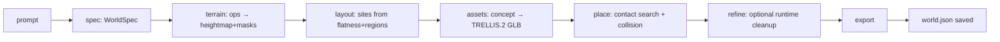
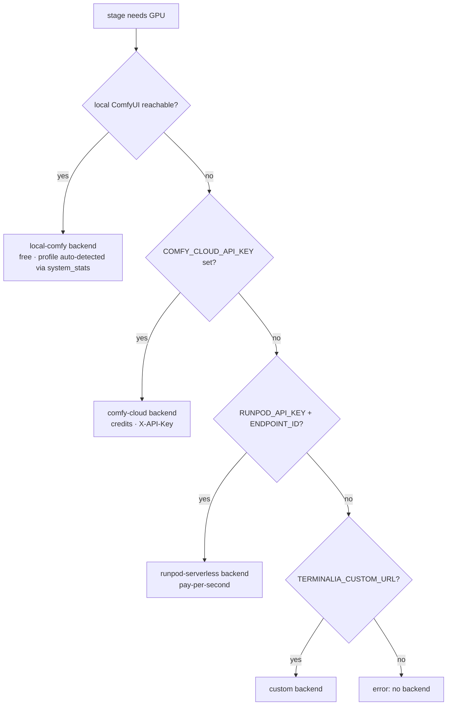

# Architecture

Terminalia turns one text prompt into an explorable, engine-ready 3D world by
chaining deterministic Python stages with generative models. An agent (or a
human) orchestrates; `world.json` carries all state between stages.

## Repo map

```
terminalia/            python package
├── schema.py          World/WorldSpec/Terrain/Layout pydantic contract
├── terrain.py         procedural heightfield engine + operator programs
├── layout.py          flat-area scoring, region-masked site selection
├── assets.py          concept image → TRELLIS.2 PBR GLB via ComfyUI
├── place.py           contact-ratio placement search + collision pass
├── refine.py          optional render cleanup via FixAnything
├── backends.py        compute routing: local / Comfy Cloud / RunPod / custom
├── video.py           flythroughs, character lock, face swap, repo integrations
├── export.py          UE / Unity / Godot / glTF writers
└── cli.py             `python -m terminalia generate|validate`
docs/                  architecture, how-it-works, onboarding, roadmap
skills/                agent skill definitions per stage (see docs/skills.md)
tests/                 smoke tests
workflows/             ComfyUI workflow templates used by assets.py
```

## The two most important flows

### Flow 1 — World generation (`python -m terminalia generate`)



Each stage writes its section of `world.json`. Any stage can be re-run:
delete its section, re-run, and downstream stages pick up the change.

### Flow 2 — Compute routing (`terminalia.backends.resolve`)



The chosen backend returns a **GpuProfile** (mesh preset, steps, decoder mode,
video quantization) so the same world spec scales from a 12GB card to a DGX
Spark without editing workflows.

## Hardware profiles

| Profile | VRAM | Mesh preset | Steps (ss/shape/tex) | Video quant |
|---|---|---|---|---|
| rtx-3060-12gb | 12 | 512 | 12/12/8 | Q4_K_M |
| rtx-4090-24gb | 24 | 1024_cascade | 30/16/16 | Q6_K |
| rtx-5090-32gb | 32 | 1536_cascade | 40/16/16 | Q8_0 |
| rtx-6000-48gb | 48 | 1536_cascade (full decode) | 50/24/24 | fp16 |
| dgx-spark-128gb | 128 | 1536_cascade (full decode) | 60/32/32 | bf16 |

Remote backends report their own hardware; profiles are clamped to what the
backend advertises when it can be queried.

## Design invariants

1. Deterministic given seed — no wall-clock or ambient randomness in stages.
2. `world.json` is the only state; stages are pure functions over it.
3. Backends are swappable; nothing hardcodes localhost or a specific GPU.
4. Every stage = plain function with JSON-shaped inputs and outputs.
